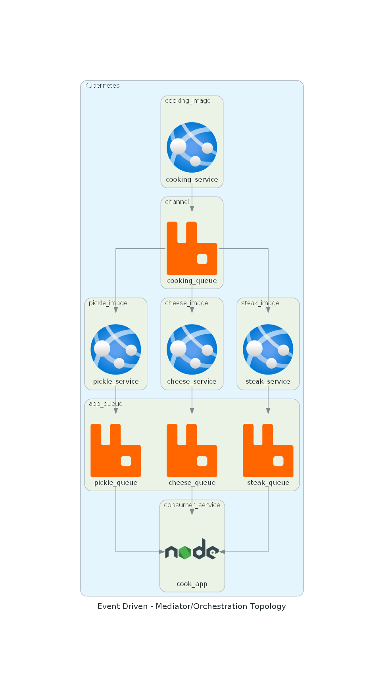

# Event Driven - Mediator Topology

Demonstrating in a fun way how to use event driven architecture.

## :eyes: What's next
- Implementing the steak and pickle service
- Implementing the client page to interact with elements
- Unit tests

## :triangular_ruler: Big Picture 

